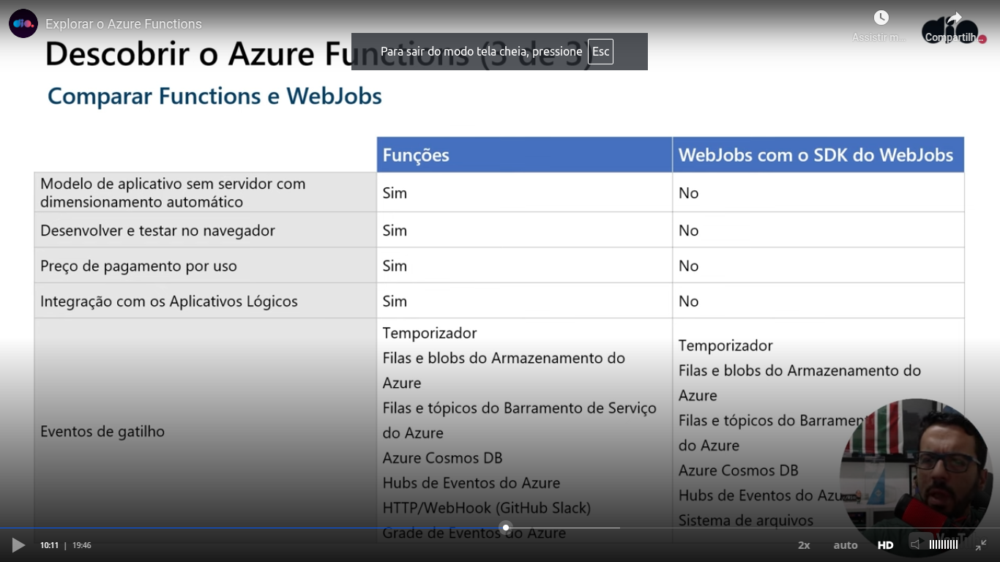
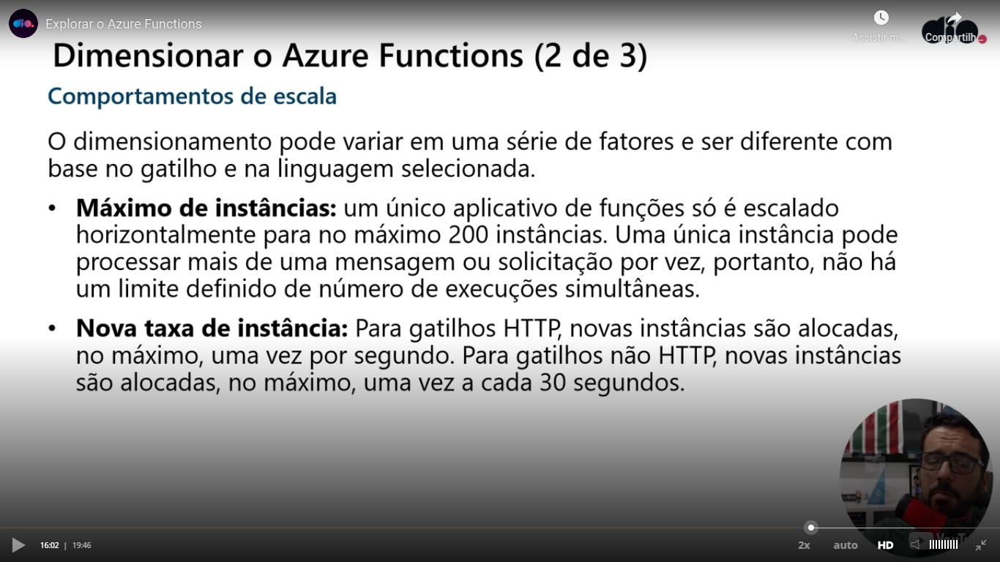
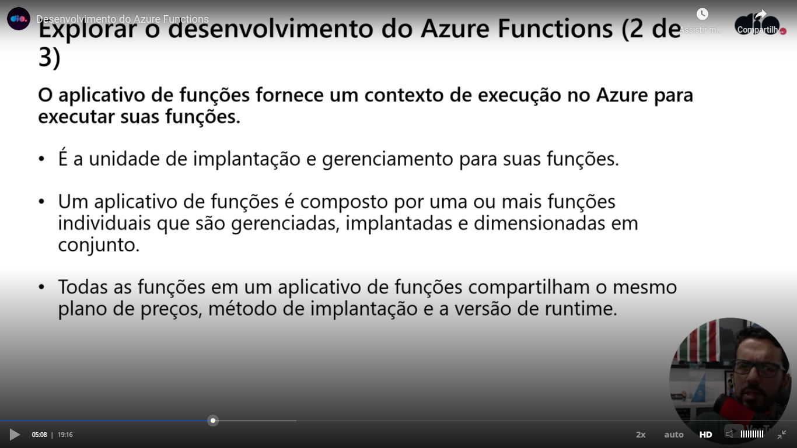
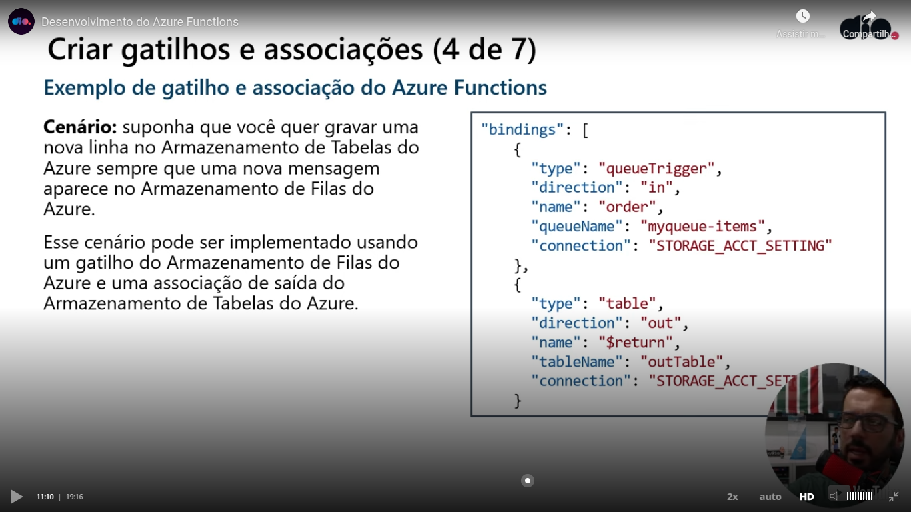
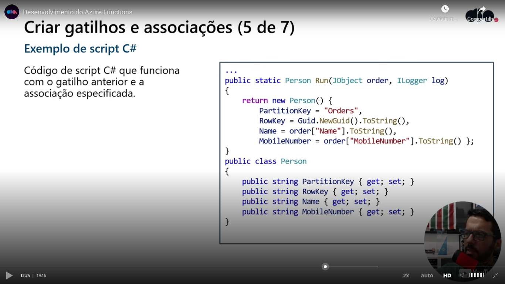
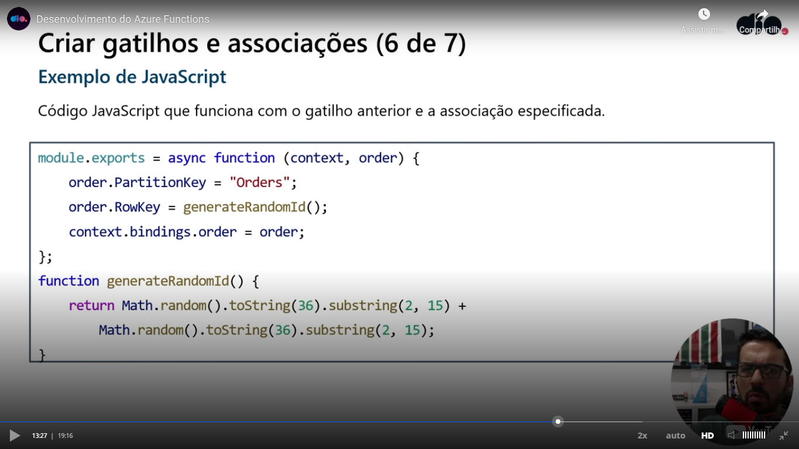

# Introduction

Teacher equipared azure functions as the old web jobs:

There are three consumption plans:

- Consumption;
- Premium;
- Dedicated.

The consuption plan has autoscale (automatic scale). Premium is related to a low latency, integrations. Dedicated is related to the functions that is hardly used. The consumption plan is the most used.

The consumption plan has a default time limit of 5 minutes and a maximum time limit of 10 minutes. The premuim and dedicated plans has a default limit of 30 minutes and no maximum limit.

If the function is not used for a interval of time, it will occur a cold start and the function will need more time to answer.

# Scale behaviour

Azure functions has autoscale, but you can limit the maximum number of instances (*functionAppScaleLimit*).

# Function apps

# Running your functions offline

You can run your functions offline and this functions can connect to online resources.

# Triggers

Teacher said that every function can have only one trigger.

The way you define a trigger is different. It depends on the programming language. Examples:

- **Java**: identification of methods and parameters with annotations;
- **C#**: identification of methods and parameters with attributes C#.
- **Python**: the use of the file **functions.json**;
- **JavaScript**: the use of the file **functions.json**;
- **TypeScript**: the use of the file **functions.json**;
- **Power shell**: the use of the file **functions.json**.

# Associations

Teacher said that associations are used to connect the function to other resources, like databases. Writing in a blob storage is an example of output association.

# Direction of the association

In or out. Triggers are always uses the **in** direction. Input associations uses the **in** direction. Output associations uses the **out** direction. Exists the direction **inout** used in more complex situations.

# Association example

Code example that uses the previous associations (C#):

Another code example (JavaScript):

# Environment variables

One advice of the teacher is to use environment variables to store sensitive data, like sensible data of databases.

# Identities

You can also use an identity related to the sensible data. Teacher said that this is recommended.

# Slides of the course

Please see [this link](slides-of-the-course.pptx).